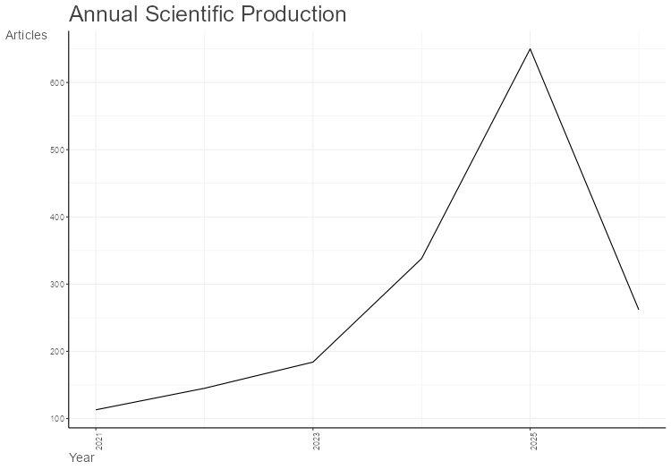
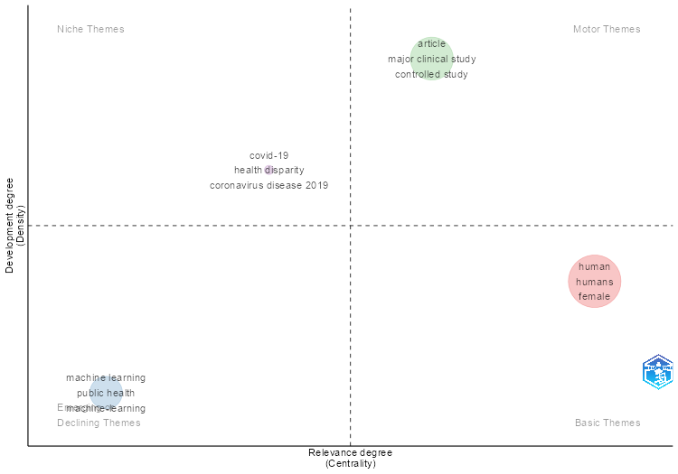

# Dashboard de Inteligencia de Negocios: Analítica en Salud Pública 📊

**Universidad Nacional Abierta y a Distancia (UNAD)**
**Curso:** Métodos Cuantitativos y Cualitativos para los Negocios (107071)
**Fase 4:** Diseño y construcción de dashboard de inteligencia de negocios

## Descripción del Proyecto
Este repositorio contiene el flujo de trabajo analítico desarrollado para fundamentar la toma de decisiones estratégicas en el sector salud. Se integra minería de texto (NLP), aprendizaje automático (Machine Learning) y estadística para analizar el estado del arte y predecir el comportamiento de la investigación sobre modelos predictivos en poblaciones vulnerables.

## ⚙️ Análisis Bibliométrico (RStudio - Biblioshiny)
A continuación, se presentan los hallazgos clave de la literatura científica extraída de Scopus para la toma de decisiones:

### 1. Tendencia Anual de Producción Científica
*(Demuestra el crecimiento exponencial del interés en esta temática)*

### 2. Nube de Palabras Clave (Author's Keywords)
*(Enfoque de los investigadores en el nicho de negocio)*

### 3. Mapa Temático Estratégico
*(Cuadrantes de desarrollo de la problemática)*

## 🚀 Estrategia de Negocios y Resultados (Python)
El análisis predictivo en Python permitió evaluar el sentimiento de la literatura frente a la implementación de estas tecnologías. En respuesta a los riesgos éticos hallados, se proponen estrategias centradas en la **explicabilidad (XAI) y equidad (Fairness)** en la adopción de algoritmos para la gestión en salud pública. 

El detalle de estas estrategias, los KPIs propuestos y las predicciones estadísticas (PDF/ML) se encuentran consolidados en el **Dashboard final**.

## 📂 Archivos del Repositorio
* `BDAU_Analytics.ipynb`: Cuaderno de Jupyter con el código fuente en Python.
* `scopus.csv`: Dataset original con la literatura científica.
* `Dashboard_Fase4_Inteligencia_Negocios.pdf`: Panel gerencial interpretado y predicciones de ML.
